# IT Help Desk & Ticketing Management System

Full stack web app for employees to submit IT support tickets, and agents/admins to manage, assign, and resolve them.

## Tech Stack
- Frontend: React (Vite)
- Backend: PHP Laravel
- Database: MySQL
- Auth: JWT (tymon/jwt-auth)

## Setup Instructions

### Prerequisites
- PHP 8.3+ and Composer
- Node.js and npm
- MySQL (local instance)

### Backend Setup
1. `cd backend`
2. `composer install`
3. Copy `.env.example` to `.env` and configure your database credentials (`DB_DATABASE=it_helpdesk_db`, `DB_USERNAME`, `DB_PASSWORD`)
4. `php artisan key:generate`
5. `php artisan migrate --seed` — creates required lookup data (categories, priorities, statuses, notification types) plus a placeholder test user (no role assigned by default)
6. `php artisan jwt:secret` (generates `JWT_SECRET`)
7. `php artisan storage:link` (enables file attachment access)
8. `php artisan serve` — backend runs at `http://127.0.0.1:8000`

### Frontend Setup
1. `cd frontend`
2. `npm install`
3. `npm run dev` — frontend runs at `http://localhost:5173`

### Optional: AI Features
To enable AI ticket categorization and the chatbot assistant, add a valid `OPENAI_API_KEY` to the backend `.env` file. Without it, these features gracefully degrade — manual category/priority entry remains fully functional.

## Screenshots

### Login
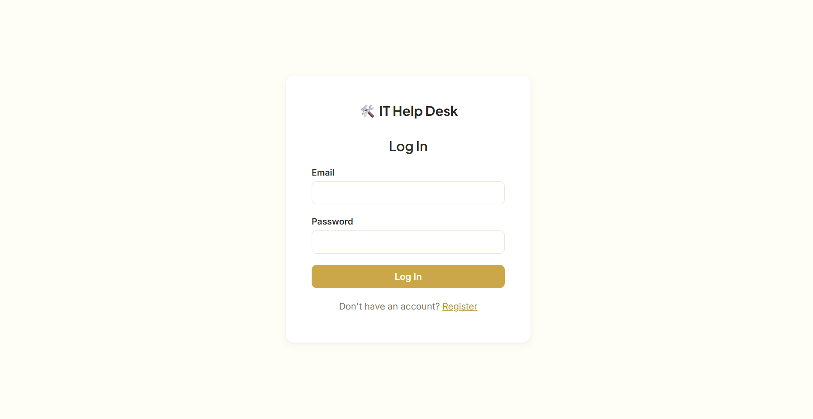

### Employee Dashboard
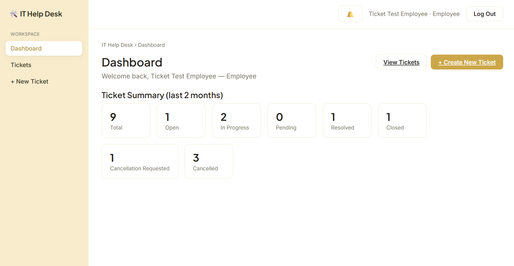

### Create Ticket Form
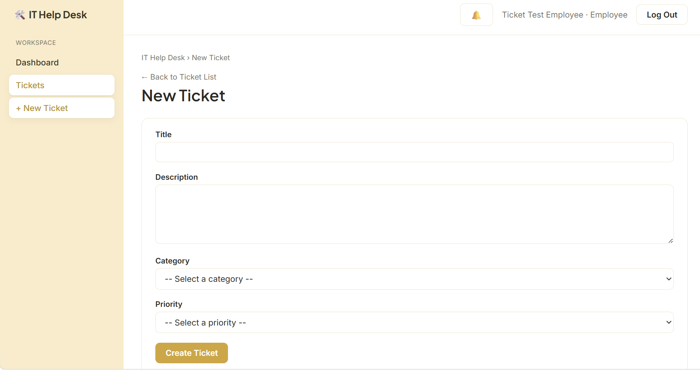

### Ticket List 
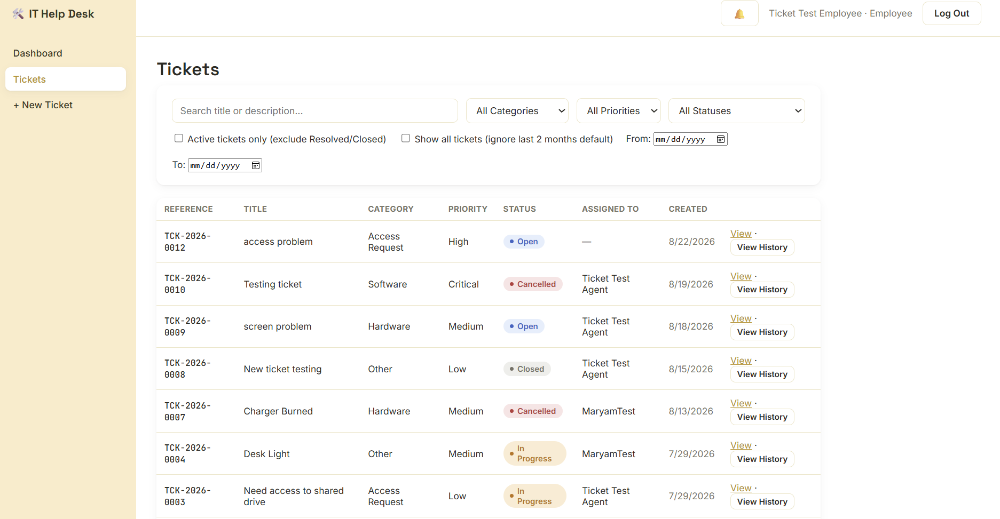

### Ticket List with Filters
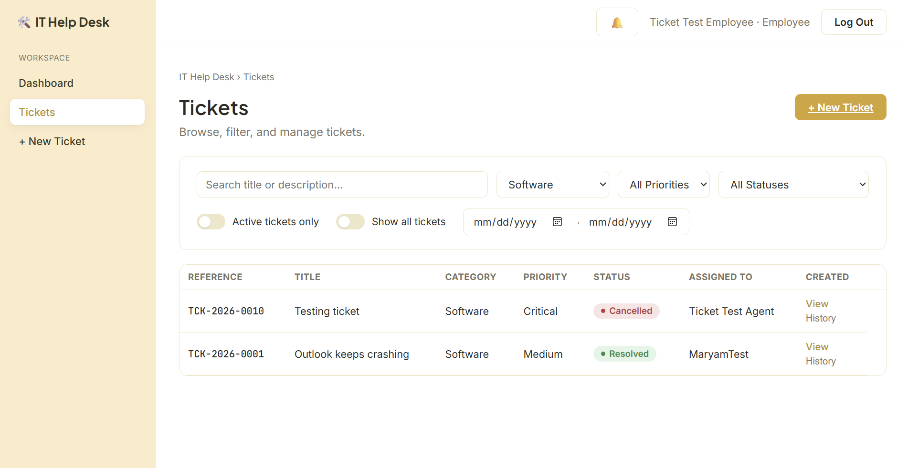

### Ticket Details (Employee view)
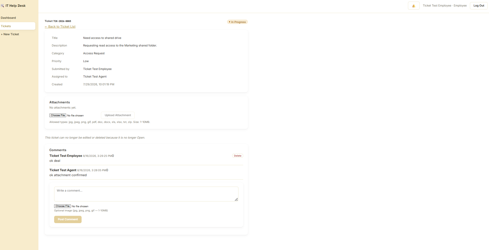

### Ticket Details (Admin view)
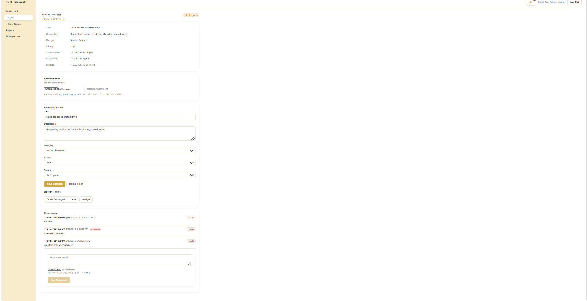

### Notifications
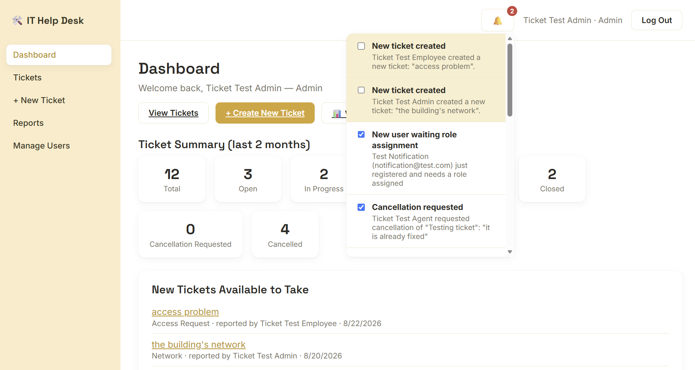

### Admin Reporting Dashboard
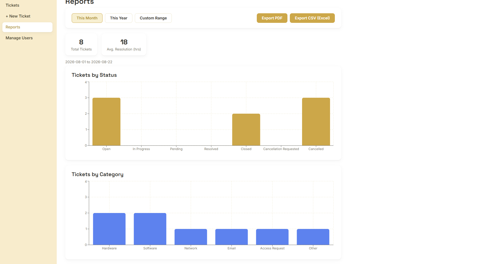
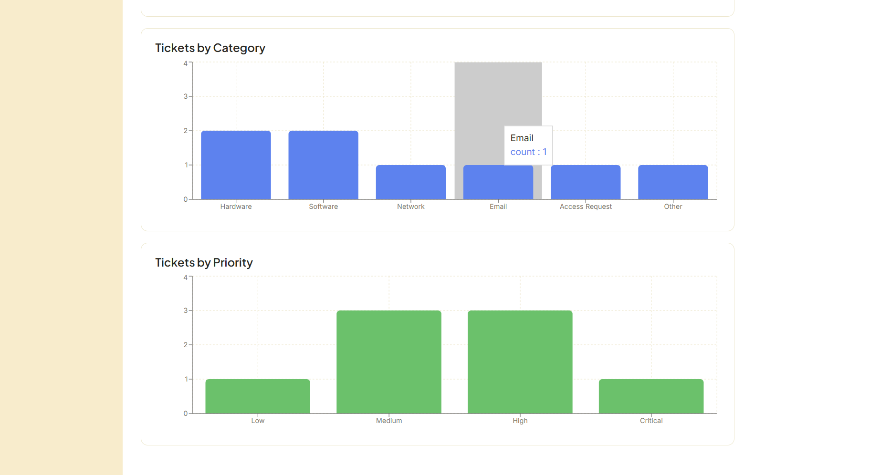

### User Management Page
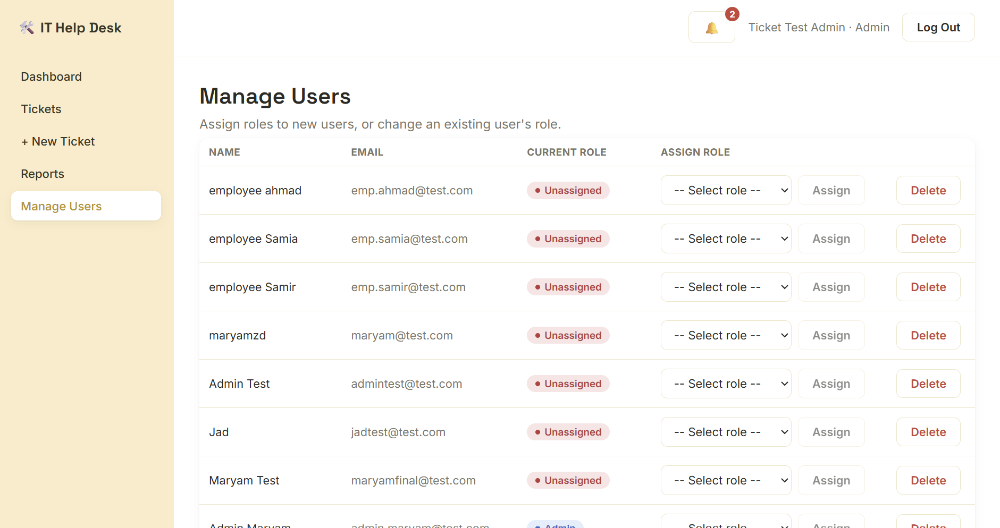

### Ticket Cancellation (Agent view)
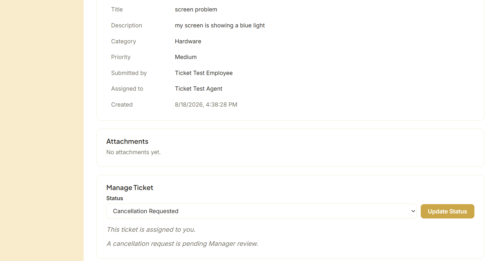

### Resolve Cancellation (Manager view)
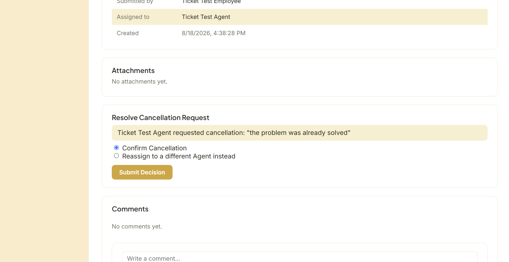

### PDF Exportation
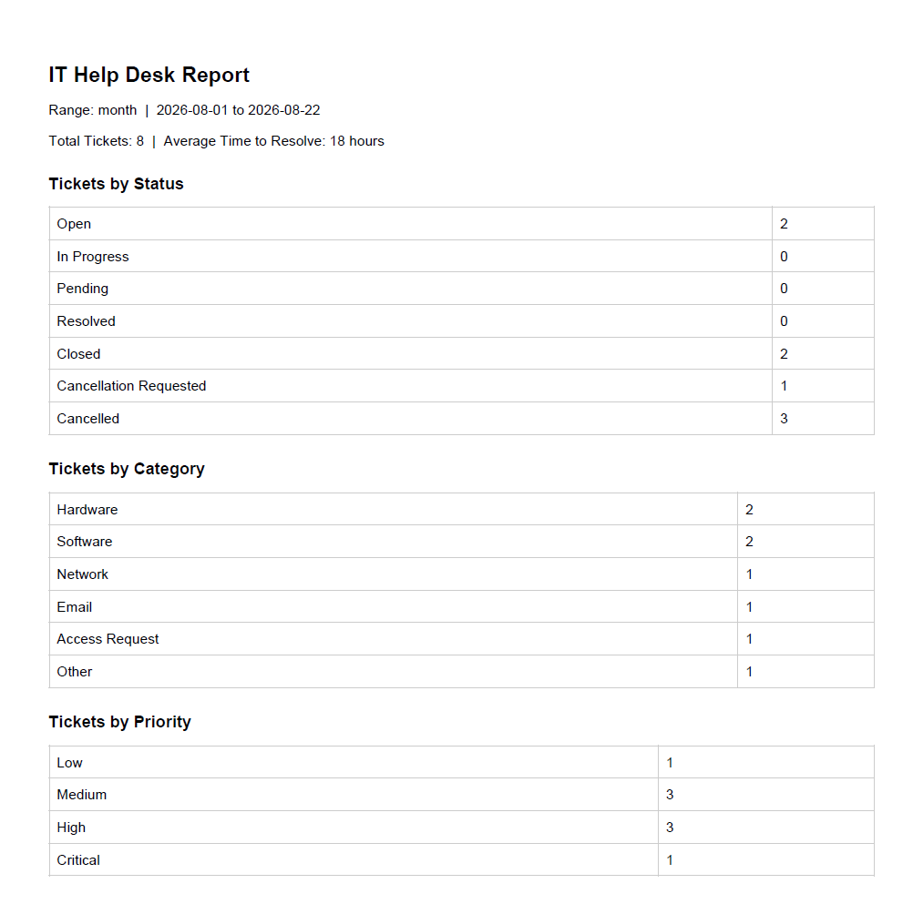

## Week 1 Deliverables
- Workflow diagrams: see `docs/workflow-diagrams/`
- UI wireframes: see `docs/wireframes/` (Figma file: [(https://www.figma.com/design/Ft7vXAN4m46XYrmIBziocx/IT-Help-Desk-%E2%80%93-Wireframes?node-id=6-179&t=v54j7OHQENUEFIsO-1)])
- Database schema & ERD: see `docs/erd/` (`it_helpdesk_erd_v4` reflects the current schema; see `it-helpdesk-schema.sql` for the full SQL definition)

## Week 2 Deliverables
- Backend project setup (Laravel + MySQL connection)
- JWT authentication: register, login, logout, `/me` endpoint
- Role-based authorization via `CheckRole` middleware (`role:<id>` route middleware)
- Roles seeded: Admin (1), IT Support Agent (2), Employee (3), Manager (4)
- Frontend project setup (React + Vite)
- Login, Register, and Dashboard (index) pages, connected to the auth API
- Renamed all database tables/columns to snake_case and foreign keys to `singular_id` format, per Laravel naming conventions

## Week 3 Deliverables
- `categories`, `priorities`, `statuses` tables — seeded with fixed values (Hardware/Software/Network/Email/Access Request/Other; Low/Medium/High/Critical; Open/In Progress/Pending/Resolved/Closed)
- `tickets` table with auto-generated `reference_no` (format: `TCK-{year}-{4-digit sequence}`, e.g. `TCK-2026-0001`)
- Full ticket CRUD via `TicketController`, with role-based permissions:
  - **Employee**: create tickets; view/edit/delete only their own, and only while status is "Open"
  - **Agent**: view all tickets; change status freely; self-assign a ticket
  - **Manager**: view all tickets
  - **Admin**: full access — create, view, edit, delete, assign, any ticket
- Search & filtering on `GET /tickets` (`category_id`, `priority_id`, `status_id`, `search`)
- Lookup endpoints (`/categories`, `/priorities`, `/statuses`, `/agents`) for frontend dropdowns
- Frontend: Ticket List (with filters), Create Ticket form, and a single role-aware Ticket Details page that shows different controls depending on the logged-in user's role

## Week 4 Deliverables
- `ticket_comments`, `activity_logs`, `ticket_status_history` tables — support comments, audit trail, and structured status history
- `POST /tickets/{id}/assign` — dedicated assignment endpoint; writes to `activity_logs`
  - **Agent**: self-assign only
  - **Admin**: assign to any Agent
  - **Manager**: forbidden — view/monitor only
- Status changes via `PUT /tickets/{id}` now write to `ticket_status_history` (old/new status, who changed it)
- `TicketCommentController` — comments/replies on tickets, with an `is_internal` flag (Agent-only) for team-only notes hidden from Employees
- `GET /tickets/{id}/activity` — merged, chronological timeline combining `activity_logs` and `ticket_status_history` into a single feed
- Workflow lock: a **Closed** ticket cannot be edited or reassigned by Agent; only **Admin** can reopen it by changing its status. Once Closed, assignment is locked for everyone (including Admin) until reopened.
- `active_only` filter on `GET /tickets` — excludes Resolved/Closed tickets
- Frontend: Comments section, reworked Assign/Status controls (per-role, using the new `/assign` endpoint), and an expandable "View History" row on the Ticket List page

## Week 5 Deliverables
- **Role-based dashboard** (`GET /dashboard/summary`) — landing page after login shows ticket counts by status, scoped per role (Employee: own tickets; Agent: assigned + unassigned tickets available to self-assign; Manager/Admin: all tickets); Agent and Admin also see a list of unassigned tickets
- Agent scoping fix on `GET /tickets` — Agents now see only tickets assigned to them plus unassigned tickets (previously saw everything); added `show_all`, `from`, `to` query params to override the default recent-tickets window
- `GET /tickets` and dashboard queries default to the **last 2 months** unless overridden
- **Notifications system** — `notifications` and `notification_types` tables (lookup pattern), `NotificationService` helper, triggered on ticket creation (Agents/Managers/Admins notified), assignment (assignee notified), and closure (Employee + Managers/Admins notified)
  - `GET /notifications`, `GET /notifications/unread-count`, `POST /notifications/{id}/read` (two-way read/unread toggle)
  - Frontend: bell icon with unread badge, dropdown list, per-notification checkbox to mark read/unread independent of navigating, one-time-per-session toast on login showing the most recent notification
- **File attachments**
  - `attachments` table — shared between ticket-level and comment-level uploads (`ticket_id`/`comment_id`, exactly one set per row)
  - Ticket-level: Employee (own ticket) or Admin only; full extension whitelist (jpg, jpeg, png, gif, pdf, doc, docx, xls, xlsx, txt, zip); 1–10MB enforced via Laravel validation (`bail` + ordered rules to avoid stacked error messages)
  - Comment-level: any commenter; images only (jpg, jpeg, png, gif); optional, attached in the same request as the comment
  - Files stored on disk (`storage/app/public`, via `storage:link`); only filename/path/mime/size saved in DB, never binary
  - Frontend: upload form + attachment list on Ticket Details; inline image thumbnails on comments
- **Ticket cancellation workflow**
  - Two new statuses: `Cancellation Requested`, `Cancelled`
  - `POST /tickets/{id}/request-cancellation` — assigned Agent only, requires a reason (logged to `activity_logs`)
  - `POST /tickets/{id}/resolve-cancellation` — Manager only; confirms cancellation or reassigns to a different Agent (status reverts to whichever status the ticket was in before the request, via `ticket_status_history`)
  - Agents blocked from reaching either cancellation status via the normal `PUT /tickets/{id}` status field — must use the dedicated endpoints; Admin is intentionally exempt from this restriction
  - Frontend: Agent request form with reason field; Manager resolution UI showing the Agent's reason, with Confirm/Reassign options
- **Admin reporting dashboard** (`GET /dashboard/report`, Admin only)
  - Ticket counts by status for This Month / This Year (toggle)
  - Average time-to-resolve, in hours (measured from ticket creation to the earliest time it reached Resolved or Closed, via `ticket_status_history`)
  - Bar chart (Recharts) visualizing counts by status

  ## Week 6 Deliverables (Final / Optional)
- **Reporting extended**: `GET /dashboard/report` now supports `range=custom` (with `start_date`/`end_date`), plus `by_category` and `by_priority` breakdowns alongside the existing `by_status` and average resolution time
- **Export**: PDF (`barryvdh/laravel-dompdf`) and CSV (PHP's built-in `fputcsv`, streamed) export of the currently-selected report range, from a dedicated `/reports` page (moved out of the Dashboard as the reporting feature set grew)
- **AI ticket categorization & priority suggestion** — `AiTicketAnalysisService` calls OpenAI (`gpt-4o-mini`) with the ticket title/description, suggesting a category and priority from the options that actually exist in the DB (validated against real values, never trusts a hallucinated category name). Triggered via a 1.2s debounce after the employee stops typing on the Create Ticket form; the employee can override any suggestion before submitting. Fails gracefully to manual entry if the AI is unavailable.
- **AI chatbot assistant** — `AiChatService` + `AiChatWidget.jsx`, single-turn Q&A scoped to IT support topics, available on the Create Ticket page
- **Comment deletion** — `DELETE /comments/{id}`; a comment's author or an Admin may delete it; deleting a comment with an attachment also removes the file from disk
- **User management** — new `UserController` (`GET /users`, `POST /users/{id}/assign-role`, `DELETE /users/{id}`) and a `/users` Admin page. New registrations no longer accept a client-supplied `role_id` (previously a self-privilege-escalation risk); users register with no role and an Admin is notified (new `New User Registered` notification type) to assign one. Admin can delete a user, blocked if that user has any tickets attached (as submitter or assigned agent) to avoid orphaned/broken ticket references.
- **Full UI redesign** — pastel-yellow design system (`index.css` custom properties for color/spacing/type), shared `Layout.jsx` (sidebar + top bar) wrapping all authenticated routes, consistent status/priority pill component, Space Grotesk/Inter/JetBrains Mono type system across every page

## Known limitations / Next steps
- Forgot/reset password and profile management are not yet implemented.
- SMTP email notifications are deferred — notifications are currently in-app only (DB-backed, bell icon + toast).
- File URLs (attachments, comment images) are currently hardcoded to `http://127.0.0.1:8000/storage/...` in the frontend; this will need to be made environment-aware before deploying anywhere beyond localhost.
- Cancellation reasons are stored as free text in `activity_logs`, not in a dedicated table — sufficient for the current "view history" use case, but not queryable/reportable on their own if that's ever needed.
- AI features (categorization, priority suggestion, chatbot) are fully implemented and gracefully degrade to manual entry / an "unavailable" message, but have not yet been tested against a live OpenAI API response — billing setup on the OpenAI account is pending. Code has been verified against the correct request/response shape; only a working API key remains.
